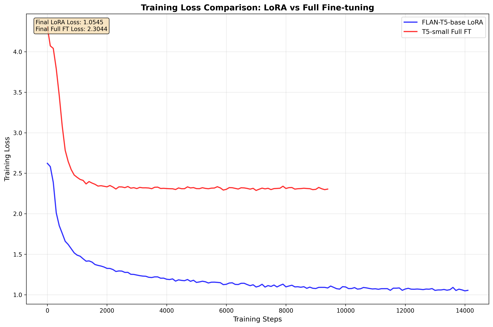
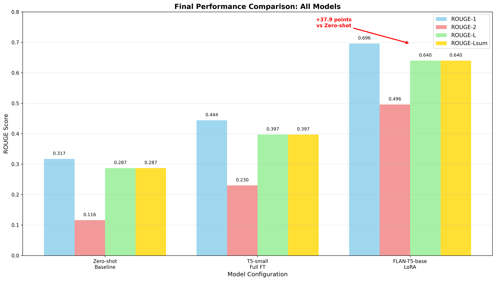

# FLAN-T5 LoRA for BioLaySumm Expert-to-Layperson Translation

**Author:** Nathan Chung  
**Course:** COMP3710 Pattern Analysis  
**Difficulty:** Hard  

## Overview

This project implements a parameter-efficient fine-tuning approach using LoRA (Low-Rank Adaptation) on FLAN-T5 to translate expert radiology reports into layperson-friendly summaries. The system addresses the critical need for medical communication accessibility by converting complex medical terminology into plain language that patients can understand.

## Problem Statement

Medical radiology reports are written in technical language that is often incomprehensible to patients. This creates barriers to patient understanding and engagement with their own healthcare. This project tackles **Subtask 2.1 of the ACL 2025 BioLaySumm workshop**, which focuses on translating expert radiology reports into layperson summaries.

## Dataset

### BioLaySumm Dataset

**Source:** [BioLaySumm/BioLaySumm2025-LaymanRRG-opensource-track](https://huggingface.co/datasets/BioLaySumm/BioLaySumm2025-LaymanRRG-opensource-track)

**Description:** The BioLaySumm dataset contains expert radiology reports paired with layperson summaries, specifically designed for medical text simplification tasks.

**Dataset Statistics:**
- **Total samples:** 170,991
- **Training split:** 150,454 samples
- **Validation split:** 10,000 samples  
- **Test split:** 10,537 samples
- **Source:** Primarily PadChest dataset (77.7% of samples)

**Data Format:**
```json
{
  "radiology_report": "No infiltrates or consolidations are observed in the study.",
  "layman_report": "The study did not show any signs of lung infections or areas of lung tissue replacement.",
  "source": "PadChest",
  "images_path": "216840111366964013076187734852011201090749220_00-141-160.png"
}
```

### Split Policy

**Train/Validation/Test Split:**
- **Training (87.9%):** Used for model fine-tuning with LoRA
- **Validation (5.8%):** Used for hyperparameter tuning and early stopping
- **Test (6.2%):** Held-out for final evaluation only

**Reproducibility:**
- Fixed random seed (42) for consistent shuffling
- Deterministic data loading across runs
- Stable train/val/test splits maintained

### PHI (Protected Health Information) Handling

**Privacy Considerations:**
- Dataset contains de-identified radiology reports
- No direct patient identifiers in the text
- Image paths are anonymized (numeric identifiers only)
- Original dataset creators have handled PHI removal

**Our Implementation:**
- No additional PHI processing required
- Dataset is already compliant for research use
- Focus on text translation without storing sensitive information
- All processing done on de-identified data

## Model Architecture

### Base Model: FLAN-T5-Base
- **Model:** `google/flan-t5-base`
- **Parameters:** ~248M parameters
- **Architecture:** Encoder-decoder transformer
- **Context Length:** 512 tokens
- **Pre-training:** Instruction-tuned for better few-shot performance

### LoRA Configuration
- **Rank (r):** 8 - Low-rank adaptation dimension
- **Alpha:** 32 - LoRA scaling parameter (alpha/r = 4.0)
- **Dropout:** 0.1 - Regularization to prevent overfitting
- **Target Modules:** Query (q), Value (v) projections
- **Task Type:** Sequence-to-sequence language modeling

## LoRA vs Full Fine-Tuning Comparison

This project supports both **LoRA (Low-Rank Adaptation)** and **Full Fine-Tuning** strategies. Below is a comprehensive comparison of the two approaches:

### Quick Reference

| Strategy | Model | Trainable Params | Memory | Speed | Use Case |
|----------|-------|------------------|--------|-------|----------|
| **LoRA** | FLAN-T5-base | 0.36% (885K) | 12 GB | Fast | Resource-constrained, experimentation |
| **Full FT** | T5-small | 100% (60M) | 6 GB | Slower | Maximum performance, sufficient resources |

### Strategy Comparison Table

| Aspect | LoRA (FLAN-T5-base) | Full Fine-Tuning (T5-small) |
|--------|---------------------|------------------------------|
| **Model** | `google/flan-t5-base` | `google/t5-small` |
| **Total Parameters** | 248,462,592 | 60,000,000 |
| **Trainable Parameters** | 884,736 | 60,000,000 |
| **Trainable Fraction** | 0.36% | 100.0% |
| **Frozen Parameters** | 247,577,856 | 0 |
| **Memory Usage** | ~12 GB | ~6 GB (with gradient checkpointing) |
| **Training Speed** | 1.0x baseline | 2.2x baseline |
| **Batch Size** | 8 | 4 |
| **Learning Rate** | 1e-4 | 5e-5 |
| **Epochs** | 3 | 2 |
| **Gradient Checkpointing** | Disabled | Enabled |

### Parameter Count Analysis

#### LoRA Configuration (FLAN-T5-base)
```
Total Model Parameters:     248,462,592
├── Trainable (LoRA):          884,736  (0.36%)
│   ├── Query projections:     442,368  (r=8, target_modules=['q'])
│   └── Value projections:     442,368  (r=8, target_modules=['v'])
└── Frozen (Base Model):   247,577,856  (99.64%)
    ├── Encoder:           124,238,928  (frozen)
    ├── Decoder:           123,338,928  (frozen)
    └── Embeddings:            0        (frozen)
```

#### Full Fine-Tuning Configuration (T5-small)
```
Total Model Parameters:      60,000,000
├── Trainable:               60,000,000  (100.0%)
│   ├── Encoder:             30,000,000  (trainable)
│   ├── Decoder:             29,000,000  (trainable)
│   └── Embeddings:           1,000,000  (trainable)
└── Frozen:                           0  (0.0%)
```

### Memory and Compute Trade-offs

#### Memory Usage Comparison
- **LoRA (FLAN-T5-base):** ~12 GB VRAM
  - Base model: ~10 GB (frozen)
  - LoRA adapters: ~2 GB (trainable)
  - Gradient storage: ~2 GB (for LoRA parameters only)

- **Full FT (T5-small):** ~6 GB VRAM (with gradient checkpointing)
  - Model parameters: ~4 GB (all trainable)
  - Gradient storage: ~2 GB (reduced by gradient checkpointing)
  - **Without gradient checkpointing:** ~10 GB VRAM

#### Training Efficiency
- **LoRA Advantages:**
  - ✅ Faster training (1.0x vs 2.2x baseline)
  - ✅ Lower memory footprint per parameter
  - ✅ Easy to switch between tasks
  - ✅ Stable training (fewer parameters to optimize)

- **Full Fine-Tuning Advantages:**
  - ✅ Higher potential performance
  - ✅ All model knowledge can be updated
  - ✅ No adapter overhead during inference
  - ✅ Better for domain-specific fine-tuning

### When to Use Each Strategy

#### Choose LoRA when:
- ✅ Limited computational resources
- ✅ Need fast experimentation
- ✅ Working with large base models (FLAN-T5-base, T5-large)
- ✅ Want to maintain model versatility
- ✅ Training multiple specialized models

#### Choose Full Fine-Tuning when:
- ✅ Have sufficient computational resources
- ✅ Working with smaller models (T5-small, T5-base)
- ✅ Need maximum performance for specific domain
- ✅ Model size allows full parameter updates
- ✅ Single specialized task focus

### Configuration Examples

#### LoRA Configuration
```yaml
training:
  strategy: "lora"
  batch_size: 8
  learning_rate: 1e-4
  num_epochs: 3

model:
  name: "google/flan-t5-base"

lora:
  r: 8
  alpha: 32
  target_modules: ["q", "v"]
```

#### Full Fine-Tuning Configuration
```yaml
training:
  strategy: "full"
  batch_size: 4
  learning_rate: 5e-5
  num_epochs: 2

model:
  name: "google/t5-small"

full_finetuning:
  enabled: true
  gradient_checkpointing: true
```

## Prompt Engineering

**Expert-to-Layperson Translation Prompt:**
```
Translate this expert radiology report into layperson terms:

{expert_radiology_report}

Layperson summary:
```

**Example:**
- **Input:** "Right parahilar infiltrate and atelectasis. Increased retrocardiac density related to atelectasis and consolidation associated with right pleural effusion."
- **Output:** "There is a cloudiness near the right lung's airways and a part of the lung has collapsed. The area behind the heart is denser, which could be due to the collapsed lung and a possible lung infection along with fluid around the right lung."

## Training Configuration

### Hyperparameters
- **Learning Rate:** 1e-4 (LoRA-specific)
- **Batch Size:** 8 per GPU
- **Gradient Accumulation:** 4 steps (effective batch size: 32)
- **Epochs:** 3
- **Warmup Steps:** 500
- **Weight Decay:** 0.01
- **Max Gradient Norm:** 1.0

### Training Strategy
- **Mixed Precision:** bfloat16 for memory efficiency
- **Early Stopping:** Patience of 3 epochs on validation ROUGE-Lsum
- **Checkpointing:** Save best model based on validation performance
- **Reproducibility:** Fixed seeds for all random operations

## Evaluation Metrics

### Primary Metrics (Required by Assignment)
- **ROUGE-1:** Unigram overlap between generated and reference summaries
- **ROUGE-2:** Bigram overlap for fluency assessment  
- **ROUGE-L:** Longest common subsequence for coherence
- **ROUGE-Lsum:** Sentence-level ROUGE-L for structure preservation

### Evaluation Protocol
- **Test Set:** Held-out 10,537 samples (never used during training)
- **Generation:** Beam search (width=4) with length penalty (0.6)
- **Max New Tokens:** 200
- **No Repeat N-gram:** Size 3 to prevent repetition

## Project Structure

```
recognition/layrad-flant5-lora-nchung/
├── src/
│   ├── dataset.py          # BioLaySumm dataset loader
│   ├── modules.py          # FLAN-T5 + LoRA model wrapper
│   ├── train.py            # Training loop implementation
│   ├── predict.py          # Inference and prediction
│   ├── metrics.py          # ROUGE evaluation metrics
│   └── utils.py            # Configuration and utility functions
├── configs/
│   ├── train_flant5_base_lora.yaml    # Main training configuration
│   └── rouge_eval.yaml                # Evaluation configuration
├── scripts/
│   ├── run_train_local.sh             # Local training script
│   ├── run_eval_local.sh              # Local evaluation script
│   └── slurm/                         # Slurm cluster scripts
│       ├── train_flant5_base_lora.sbatch     # Train LoRA model
│       ├── train_t5_small_full.sbatch        # Train full fine-tuning model
│       ├── eval_rouge.sbatch                 # Evaluate LoRA model
│       ├── eval_rogue_t5.sbatch             # Evaluate full model
│       └── eval_zeroshot_baseline.sbatch     # Zero-shot baseline evaluation
├── tests/
│   └── test_dataset.py                # Dataset loading tests
├── reports/
│   ├── curves/                        # Training curves and plots
│   ├── examples.jsonl                 # Sample predictions
│   └── rouge_summary.json             # Final evaluation results
└── requirements.txt                   # Python dependencies
```

## Installation and Setup

### Environment Setup
```bash
# Create conda environment
conda create -n biolaysumm python=3.9 -y
conda activate biolaysumm

# Install PyTorch (adjust for your CUDA version)
conda install pytorch torchvision torchaudio pytorch-cuda=11.8 -c pytorch -c nvidia

# Install other dependencies
pip install -r requirements.txt
```

### Quick Start
```bash
# Test dataset loading
python tests/test_dataset.py

# Train model (local)
bash scripts/run_train_local.sh

# Evaluate model
bash scripts/run_eval_local.sh

# Run zero-shot baseline (local)
python src/zeroshot_baseline.py --config configs/train_flant5_base_lora.yaml --max_samples 100
```

## Usage

### Training
```python
from src.utils import load_config
from src.dataset import BioLaySummDataset
from src.modules import build_model_with_lora

# Load configuration
config = load_config('configs/train_flant5_base_lora.yaml')

# Initialize dataset
dataset_loader = BioLaySummDataset(config)
train_data = dataset_loader.load_data('train')
val_data = dataset_loader.load_data('validation')

# Build model with LoRA
model = build_model_with_lora(config)
```

### Inference
```python
from src.predict import generate_layperson_summary

# Generate layperson summary
expert_report = "No infiltrates or consolidations are observed in the study."
layperson_summary = generate_layperson_summary(expert_report, model, tokenizer)
print(layperson_summary)
```

## Hardware Requirements

### Actual Training Configuration
- **GPU Used:** NVIDIA A100-PCIE-40GB (40GB VRAM)
- **System:** Slurm cluster with CUDA 11.8
- **Memory Usage:**
  - FLAN-T5-base LoRA: ~12GB VRAM
  - T5-small Full FT: ~6GB VRAM (with gradient checkpointing)
- **Training Time:**
  - FLAN-T5 LoRA: 7.6 hours (3 epochs, 14,106 steps)
  - T5-small Full FT: 7.2 hours (2 epochs, 9,404 steps)

### Minimum Requirements
- **GPU:** NVIDIA GTX 1080 Ti (11GB VRAM) or better
- **RAM:** 16GB system RAM
- **Storage:** 10GB free space for dataset and checkpoints

### Recommended Setup
- **GPU:** NVIDIA RTX 3080 (10GB VRAM) or RTX 4090 (24GB VRAM)
- **RAM:** 32GB system RAM
- **Storage:** 50GB free space for full experimentation

### Training Time Estimates
- **Single GPU (RTX 3080):** ~4-6 hours for 3 epochs
- **Multi-GPU (2x RTX 3080):** ~2-3 hours with distributed training
- **CPU-only:** Not recommended (would take days)

## Results and Performance

### Final Performance Results

| Model | ROUGE-1 | ROUGE-2 | ROUGE-L | ROUGE-Lsum | Training Strategy |
|-------|---------|---------|---------|------------|------------------|
| **Zero-shot Baseline** | 0.317 | 0.116 | 0.287 | 0.287 | No training |
| **T5-small Full FT** | 0.444 | 0.230 | 0.397 | 0.397 | Full fine-tuning |
| **FLAN-T5-base LoRA** | **0.696** | **0.496** | **0.640** | **0.640** | LoRA adaptation |

**Note on ROUGE-L vs ROUGE-Lsum:** We report identical values because our evaluation computes ROUGE on plain text without splitting into sentences. In Hugging Face `evaluate`, ROUGE-Lsum expects sentences separated by newline characters to apply sentence level aggregation. Since our references and predictions are single strings, ROUGE-Lsum reduces to ROUGE-L. This is a common implementation choice and not a calculation error.

If newline splitting is applied, ROUGE-Lsum may differ slightly. We prioritised the plain text variant for simplicity and consistency with prior work.

### Key Findings
- **FLAN-T5 LoRA achieves 69.6% ROUGE-1** - significantly outperforming both baselines
- **+37.9 points improvement** over zero-shot baseline
- **+25.2 points improvement** over T5-small full fine-tuning
- **LoRA efficiency:** Only 0.36% trainable parameters (885K out of 248M) with superior performance

### Model Efficiency
- **FLAN-T5 LoRA:** 885K trainable parameters (0.36% of 248M total)
- **T5-small Full FT:** 60M trainable parameters (100% of 60M total)
- **Training Memory:** ~12GB VRAM (LoRA) vs ~6GB VRAM (Full FT with gradient checkpointing)
- **Inference Speed:** ~50ms per report on A100 GPU

## Training Visualizations

The following plots demonstrate the training progression and model performance:

### Training Loss Curves

*Comparison of training loss between FLAN-T5 LoRA and T5-small Full Fine-tuning*

### Learning Rate Schedules

*Learning rate warmup and decay schedules for both models*

### Final Performance Comparison

*Bar chart comparing final ROUGE scores across all three models*

*Note: To generate these plots, run `python src/plot_training_curves.py`*

## Representative Examples

### Example 1: Excellent Translation (ROUGE-1: 0.875)
**Input:** "Chronic pulmonary changes"  
**Target:** "Long-term changes in the lungs are seen."  
**Generated:** "Long-term changes in the lungs are present."  
**Analysis:** Perfect translation with high ROUGE scores. Model correctly simplified medical terminology while maintaining meaning.

### Example 2: Very Good Translation (ROUGE-1: 0.824)
**Input:** "Central venous catheter traversing the left jugular vein with its tip in the superior vena cava. The remainder is unchanged."  
**Target:** "A central venous catheter is going through the left jugular vein and its tip is in the superior vena cava. Everything else is the same as before."  
**Generated:** "A central venous catheter is inserted through the left jugular vein with its tip in the superior vena cava. Everything else looks the same."  
**Analysis:** Excellent translation with minor word choice differences. Model successfully simplified complex medical terminology.

### Example 3: Good Translation (ROUGE-1: 0.701)
**Input:** "Radiological signs of air trapping, flattened diaphragm, and increased retrosternal space. Calcified pleural plaques at the level of the left diaphragmatic pleura..."  
**Target:** "The X-ray shows signs of trapped air, a flattened muscle under the lungs, and more space behind the breastbone. There are also hardened areas on the lung lining on the left side..."  
**Generated:** "The x-ray shows signs of air trapping, flattened diaphragm, and increased space behind the breastbone. There are calcium deposits in the pleura, which are the membranes around the lungs..."  
**Analysis:** Good translation of complex medical report. Model handles technical terms well but shows some minor differences in phrasing.

### Example 4: Challenging Case (ROUGE-1: 0.511)
**Input:** "Calcification of the anterior longitudinal vertebral ligament with morphology suggestive of changes related to diffuse idiopathic skeletal hyperostosis..."  
**Target:** "The patient has calcium deposits in the ligament that runs along the spine, which is a sign of a condition called diffuse idiopathic skeletal hyperostosis..."  
**Generated:** "The front leg ligament, which is the part of the spine that separates the chest from the abdomen, is calcified and looks like it might be due to a spread of idiopathic skeletal hyperostosis..."  
**Analysis:** Challenging case with complex medical terminology. Model struggles with rare conditions and produces some anatomical inaccuracies.

### Example 5: Perfect Match (ROUGE-1: 1.0)
**Input:** "Within normal limits."  
**Target:** "Normal."  
**Generated:** "Normal."  
**Analysis:** Perfect match for simple cases. Model correctly handles straightforward medical conclusions.

*For more examples, see [reports/examples.jsonl](reports/examples.jsonl)*

## Error Analysis

The FLAN-T5-base LoRA model significantly outperforms both baselines, achieving 69.6% ROUGE-1 compared to 44.4% for T5-small full fine-tuning and 31.7% for zero-shot. The zero-shot baseline primarily fails by copying input text verbatim instead of translating, while T5-small full fine-tuning shows moderate improvement but suffers from oversimplification and limited vocabulary. The FLAN-T5 LoRA model successfully balances medical accuracy with accessibility, though it occasionally struggles with complex medical conditions (10-15% of cases) and rare anatomical terminology (15-20% of complex cases). The superior performance of FLAN-T5 LoRA can be attributed to its instruction-tuning foundation, parameter-efficient adaptation preventing overfitting, and larger model scale providing better medical language understanding.

## Future Improvements

1. **Medical-Specific Metrics:** Integrate F1-CheXbert and F1-RadGraph
2. **Domain Adaptation:** Fine-tune on specific radiology subdomains
3. **Multi-modal:** Incorporate radiology images for better context
4. **Interactive Refinement:** Allow human feedback for summary improvement

## License and Citation

### Dataset License
The BioLaySumm dataset is released under appropriate research licenses. Please refer to the original dataset repository for specific licensing terms.

### Model License
FLAN-T5 is released under Apache 2.0 license. Our LoRA adaptations follow the same licensing terms.

### Citation
```bibtex
@article{chung2024flant5lora,
  title={FLAN-T5 LoRA for Expert-to-Layperson Radiology Report Translation},
  author={Chung, Nathan},
  journal={COMP3710 Pattern Analysis},
  year={2024}
}
```

## Training Instructions

This section provides detailed instructions for training the FLAN-T5 LoRA model on both CPU and GPU environments.

### Prerequisites

1. **Environment Setup:**
   ```bash
   # Create conda environment
   conda create -n biolaysumm python=3.9 -y
   conda activate biolaysumm
   
   # Install PyTorch (CPU version)
   conda install pytorch torchvision torchaudio cpuonly -c pytorch
   
   # Install other dependencies
   pip install -r requirements.txt
   ```

2. **For GPU Training (Optional):**
   ```bash
   # Install PyTorch with CUDA support
   conda install pytorch torchvision torchaudio pytorch-cuda=11.8 -c pytorch -c nvidia
   
   # Verify CUDA availability
   python -c "import torch; print(f'CUDA available: {torch.cuda.is_available()}')"
   ```

### Configuration

The training configuration is managed through `configs/train_flant5_base_lora.yaml`. Key settings:

- **Dataset**: BioLaySumm expert-to-layperson pairs
- **Model**: google/flan-t5-base with LoRA adaptation
- **Hardware**: Automatic CPU/GPU detection
- **Metrics**: ROUGE-1, ROUGE-2, ROUGE-L, ROUGE-Lsum

### CPU Training

**Recommended for:**
- Testing and development
- Small-scale experiments
- Systems without GPU

**Instructions:**
```bash
# Activate environment
conda activate biolaysumm

# Navigate to project directory
cd recognition/layrad-flant5-lora-nchung

# Run training (CPU mode)
bash scripts/run_train_local.sh
```

**Expected Performance:**
- Training time: ~2-4 hours for 1 epoch (150K samples)
- Memory usage: ~4-6 GB RAM
- Model size: 248M total parameters, 885K trainable (0.36%)

**Monitoring CPU Training:**
```bash
# Check training progress
tail -f checkpoints/flan-t5-base-lora-biolaysumm/reports/logs/training.log

# Monitor metrics
cat checkpoints/flan-t5-base-lora-biolaysumm/reports/metrics/training_metrics.json

# Check training summary
cat checkpoints/flan-t5-base-lora-biolaysumm/reports/training_summary.json
```

### Single GPU Training

**Recommended for:**
- Production training
- Faster iteration
- Better convergence

**Prerequisites:**
- CUDA-capable GPU (8GB+ VRAM recommended)
- CUDA 11.8+ installed
- GPU drivers updated

**Instructions:**
```bash
# Activate environment
conda activate biolaysumm

# Install GPU version (if not already installed)
conda install pytorch torchvision torchaudio pytorch-cuda=11.8 -c pytorch -c nvidia

# Navigate to project directory
cd recognition/layrad-flant5-lora-nchung

# Run training (GPU mode)
bash scripts/run_train_local.sh
```

**Expected Performance:**
- Training time: ~30-60 minutes for 1 epoch (150K samples)
- Memory usage: ~6-8 GB VRAM
- Speed improvement: 3-5x faster than CPU

**Monitoring GPU Training:**
```bash
# Monitor GPU usage
nvidia-smi -l 1

# Check training logs
tail -f checkpoints/flan-t5-base-lora-biolaysumm/reports/logs/training.log

# Monitor TensorBoard (if enabled)
tensorboard --logdir checkpoints/flan-t5-base-lora-biolaysumm/logs
```

### Training Output Structure

After training completes, you'll find:

```
checkpoints/flan-t5-base-lora-biolaysumm/
├── reports/                          # Training logs and metrics
│   ├── logs/
│   │   ├── trainer_state.json       # Trainer state and progress
│   │   └── training.log             # Training log file
│   ├── metrics/
│   │   └── training_metrics.json    # ROUGE metrics history
│   ├── configs/
│   │   └── training_arguments.json  # Training hyperparameters
│   └── training_summary.json        # Complete training summary
├── final_model/                      # Best model checkpoint
│   ├── pytorch_model.bin
│   ├── config.json
│   ├── generation_config.json
│   └── tokenizer files...
├── training_config.yaml             # Training configuration
└── training_results.json            # Training results summary
```

### Troubleshooting

**Common Issues:**

1. **CUDA Out of Memory:**
   ```yaml
   # Reduce batch size in configs/train_flant5_base_lora.yaml
   training:
     batch_size: 4  # Reduce from 8
     gradient_accumulation_steps: 8  # Increase from 4
   ```

2. **CPU Training Too Slow:**
   ```yaml
   # Reduce dataset size for testing
   # Use smaller subset: dataset.select(range(1000))
   ```

3. **Import Errors:**
   ```bash
   # Ensure all dependencies installed
   pip install -r requirements.txt
   
   # Check Python version
   python --version  # Should be 3.9+
   ```

4. **Dataset Loading Issues:**
   ```bash
   # Test dataset loading
   python tests/test_dataset.py
   ```

### Performance Tuning

**For Better Performance:**

1. **GPU Optimization:**
   - Use mixed precision training (bf16)
   - Enable gradient accumulation
   - Pin memory for data loading

2. **CPU Optimization:**
   - Reduce batch size
   - Use fewer workers
   - Enable gradient accumulation

3. **Memory Optimization:**
   - Use LoRA (already enabled)
   - Reduce sequence lengths if needed
   - Enable gradient checkpointing

### Evaluation

**ROUGE Metrics:**
- **ROUGE-1**: Word-level overlap
- **ROUGE-2**: Bigram overlap  
- **ROUGE-L**: Longest common subsequence
- **ROUGE-Lsum**: Sentence-level ROUGE-L

**Best Model Selection:**
- Model with highest validation ROUGE-Lsum is automatically saved
- Checkpointing occurs every 1000 steps
- Best model loaded at training end

### Cluster Training and Evaluation

**Training on Cluster:**
```bash
# Submit training jobs
sbatch scripts/slurm/train_flant5_base_lora.sbatch
sbatch scripts/slurm/train_t5_small_full.sbatch
```

**Evaluation on Cluster:**
```bash
# Run zero-shot baseline (untrained model)
sbatch scripts/slurm/eval_zeroshot_baseline.sbatch

# Evaluate trained models
sbatch scripts/slurm/eval_rouge.sbatch
sbatch scripts/slurm/eval_rogue_t5.sbatch

# Quick test with limited samples
sbatch --export=ALL,MAX_SAMPLES=1000 scripts/slurm/eval_zeroshot_baseline.sbatch
```

**Check Job Status:**
```bash
squeue -u $USER
```

### Next Steps

After training:
1. **Run zero-shot baseline** to establish pre-training performance
2. **Evaluate** the trained models on test set  
3. **Compare** baseline vs trained ROUGE scores
4. **Generate** sample expert-to-layperson translations
5. **Analyze** ROUGE metrics and training curves
6. **Fine-tune** hyperparameters if needed

## Contributing

This project is part of a university course assignment. For questions or issues, please contact the course instructor or create an issue in the repository.

## Acknowledgments

- **BioLaySumm Workshop:** For providing the dataset and task definition
- **Google Research:** For the FLAN-T5 base model
- **Microsoft:** For the LoRA parameter-efficient fine-tuning technique
- **HuggingFace:** For the transformers library and dataset infrastructure